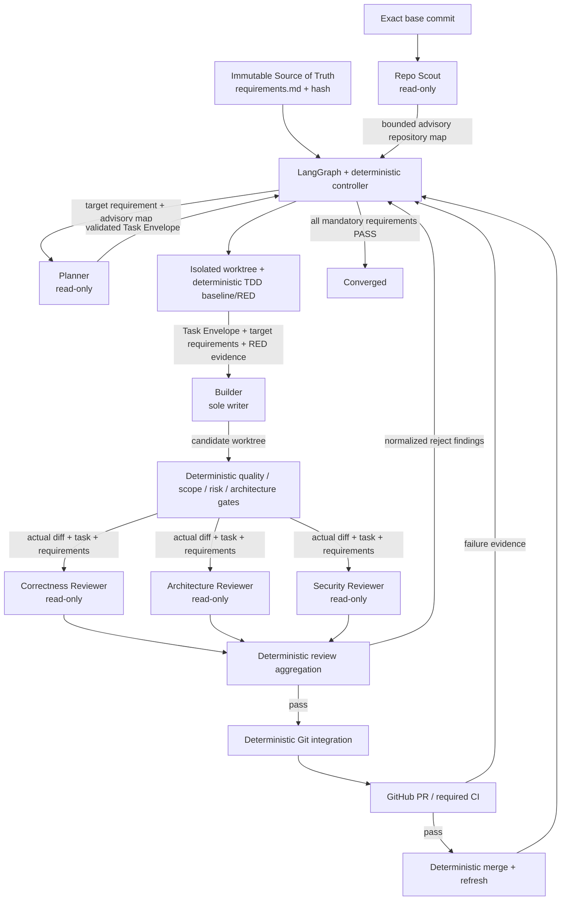

# Agent roles, model selection, and data flow

This document defines **functional role contracts**, not just the default model names. A model may be
replaced without changing the LangGraph workflow as long as the replacement satisfies the role's
requirements. Role boundaries, allowed data, permissions, Skills, MCP access, and deterministic gates
are more important than a particular LLM vendor.

The key rule is: **models do not orchestrate one another**. LangGraph plus deterministic Converge code
selects the next state, target requirement, retry/replan path, review gate, PR/CI transition, and merge.
There is no durable agent-to-agent chat. Every OpenCode call is a fresh session and continuity is
carried only through explicit LangGraph state and evidence artifacts.

## A model profile is not an agent

`models.profiles` describes reusable model/runtime parameters. `agents` binds one of those profiles to
a concrete function. Therefore the profile name `reviewer` does not mean one universal Reviewer, and
the `planner` profile can be used by both Planner and Architecture Reviewer.

The reference quality-first routing is:

| Profile | Reference model | Runtime function |
| --- | --- | --- |
| `scout` | `deepseek-v4-flash:cloud` | Repo Scout |
| `planner` | `deepseek-v4-pro:cloud` | Planner and Architecture Reviewer |
| `builder` | `kimi-k2.7-code:cloud` | Builder |
| `reviewer` | `glm-5.3-flash:cloud` | Correctness Reviewer |
| `security` | `gpt-oss:120b` | Security Reviewer |

These are replaceable examples, not hard vendor dependencies. They represent different trade-offs in
latency, reasoning, coding/tool-loop quality, useful context, and independence of review.

## Exact role contracts

### Repo Scout

**Purpose:** build a fast, evidence-backed map of the exact base commit before planning.

Scout may inspect repository structure, dependencies, tests, relevant modules, and visible architecture
boundaries. It does not select the next target requirement, create the Task Envelope, or design the
implementation. Its output is advisory: Planner must reason from the immutable Source of Truth and the
repository itself rather than treating Scout narrative as authority.

The normal handoff contains relevant paths, boundaries, risky surfaces, and explicit uncertainties. It
does not contain a shared chat history or hidden reasoning trace.

### Planner

**Purpose:** for the requirement ID selected by deterministic policy, plan **one smallest valuable and
verifiable convergence step**.

Planner is read-only. It receives the deterministic target requirement, relevant architecture
statements/source anchors, a bounded advisory Scout snapshot, and explicit progress state. It returns
a structured `TaskEnvelope`: objective, allowed paths, acceptance criteria, risk, change kind, and TDD
contract. Planner cannot switch to an easier requirement, write implementation code, or control GitHub.

### Builder

**Purpose:** implement exactly one validated Task Envelope in an isolated worktree.

Builder is the **only LLM writer**. It receives the exact target requirement statements/source anchors,
the Task Envelope, and verified TDD RED evidence when applicable. It does not need Scout's complete
narrative or Planner's session history. It may edit the active worktree and run local implementation and
test tools, but cannot `git push`, use `gh`, merge, perform destructive reset/clean, edit the immutable
Source of Truth, or delegate hidden subagents. Git/GitHub integration remains deterministic Converge
code.

### Correctness Reviewer

**Purpose:** independently find behavioral errors, regressions, edge cases, weak tests, and hidden
compatibility changes.

It is read-only and evaluates the **actual diff, relevant surrounding code, Task Envelope, and
requirements**, not a Builder self-description. When practical, use a model family different from the
Builder to reduce correlated self-review errors.

### Architecture Reviewer

**Purpose:** detect architectural drift, invalid dependency direction, boundary violations, scope
expansion, accidental public API changes, inappropriate coupling, and changes that satisfy a local task
by weakening the intended architecture.

It is read-only. It may use the same model family as Planner because it does not review its own
implementation and runs in a fresh session, but it should remain independent from Builder.

### Security Reviewer

**Purpose:** independently assess security-sensitive changes: authentication/authorization, secrets,
injection, command/path handling, insecure defaults, dependency risks, and trust boundaries.

It is read-only. Prefer a model family independent from Builder and, where practical, from the other
reviewers. No response, process failure, or malformed review is not interpreted as "no security
problem": failure-to-review blocks integration.

## The orchestrator is not another LLM agent

Converge deliberately does **not** add a manager/orchestrator model. An LLM manager would introduce a
second nondeterministic control plane and increase goal-drift risk. Coordination belongs to LangGraph
plus deterministic Python policy. That layer:

- selects the target requirement using explicit policy;
- invokes Scout, Planner, Builder, and Reviewers;
- enforces retry/replan/context budgets;
- runs deterministic quality, scope, risk, architecture, and requirement gates;
- owns worktrees, commit/push, PR, CI, and optional merge transitions;
- restores work after process failure;
- escalates HITL only for defined exceptions and exhausted bounded recovery.

## Workflow and agent data-flow model



The arrows are **explicit data artifacts**, not direct agent conversations. Reviewers never receive a
hidden Builder session. Builder does not receive Planner's transcript. Repair receives normalized,
lane-attributed findings and deterministic gate evidence.

## Allowed data handoffs

| From | To | Allowed artifact | Purpose |
| --- | --- | --- | --- |
| Source of Truth | roles that need it | requirement IDs, statements, source anchors | authoritative goal |
| Scout | Planner | bounded advisory repository map | fast orientation without durable narrative |
| Planner | Builder | validated Task Envelope | exact bounded work scope |
| TDD controller | Builder | verified RED evidence | RED -> GREEN without weakening the test |
| candidate worktree | Reviewers | actual diff + necessary surrounding code | independent evidence |
| quality/risk gates | controller/repair | structured results | deterministic transition decision |
| Reviewers | Builder repair | aggregated lane-attributed findings | focused repair without shared sessions |
| LangGraph | next iteration | bounded working-memory fields | controlled continuity |

The following are not default handoffs: hidden chat history, `--continue`/shared model sessions,
provider credentials, the complete state/evidence directory, irrelevant raw output from another role,
Builder narrative as review evidence, or MCP credentials assigned to another role.

## MCP: least privilege per role

MCP servers are declared centrally under `opencode.mcp.servers`, but they are not automatically active
for every agent. Converge interprets a role's explicit `tool_permissions: <server>_*` entry as the
assignment of that MCP server to that role. At runtime, known configured servers not assigned to the
active role are `enabled: false`; their `{env:SECRET}` references are not forwarded to that agent
process. An explicitly disabled MCP server remains disabled even if the role grants its tool pattern.

Example:

```yaml
opencode:
  mcp:
    servers:
      docs:
        type: remote
        url: https://mcp.example.com/mcp
        headers:
          X-API-Key: "{env:DOCS_MCP_API_KEY}"

agents:
  scout:
    agent: converge-scout
    model_profile: scout
    tool_permissions:
      docs_*: allow

  builder:
    agent: converge-builder
    model_profile: builder
    tool_permissions: {}
```

Only Scout can use `docs_*`, and only Scout's process receives `DOCS_MCP_API_KEY`. Builder neither
enables this MCP server nor receives that credential.

Recommended MCP scope:

| Role | Good MCP candidates | Keep outside agent authority |
| --- | --- | --- |
| Scout | read-only code search, documentation, schema/catalog | writes, deployment, GitHub mutation |
| Planner | read-only docs, issue metadata, architecture catalog | DB writes, merge, deployment |
| Builder | project-specific build/test helpers, read-only docs | push/merge, deployment, secrets admin |
| Correctness Reviewer | read-only repo/docs/test metadata | write tools |
| Architecture Reviewer | read-only dependency/docs/catalog | write tools |
| Security Reviewer | read-only security/dependency metadata | credential mutation, deployment/write |

Critical Git/GitHub operations and deterministic gate policy remain host-side deterministic code, not
agent-controlled MCP. A model therefore cannot bypass a failed gate by invoking a tool or merge itself.

## Skills: role-specific and managed by Converge

Converge materializes trusted runtime Skills outside the target repository under
`<state_dir>/opencode-runtime/skills/` and points OpenCode at that directory through
`OPENCODE_CONFIG_DIR`. The `skill` permission is an explicit per-role allowlist with `*` denied, so
unrelated global/project Skills do not become instructions for every agent.

| Role | Managed Skills |
| --- | --- |
| Scout | `repo-scout`, `requirements-compliance` |
| Planner | `bounded-planning`, `requirements-compliance` |
| Builder | `test-driven-change`, `requirements-compliance` |
| Correctness Reviewer | `correctness-review`, `requirements-compliance` |
| Architecture Reviewer | `architecture-review`, `requirements-compliance` |
| Security Reviewer | `security-review`, `requirements-compliance` |

`task` remains denied, so an agent cannot create hidden subagents as an uncontrolled memory or
delegation channel.

## How to replace a model consciously

Preserve the **role contract** first, then replace the model profile. Evaluate candidate models on tasks
similar to the target repository rather than selecting by parameter count or advertised context window
alone.

| Role | Critical capabilities | Desirable properties | Reject the model when... |
| --- | --- | --- | --- |
| Scout | stable read/tool calls, code/repo summarization, instruction following | low latency/cost, useful long context | it turns observations into plans, violates read-only intent, or tool use is unstable |
| Planner | strong reasoning, strict structured output, architecture understanding, minimal-scope planning | broad useful context, strong TDD reasoning | it changes targets, proposes broad rewrites, or cannot reliably emit Task Envelope JSON |
| Builder | coding accuracy, long tool-loop stability, test literacy, patch discipline | strong debugging/refactoring, useful 128k-256k+ context | it loses tool-loop state, weakens tests/APIs, or produces large accidental diffs |
| Correctness Reviewer | code reasoning, adversarial bug finding, edge-case/test/backcompat analysis | different family from Builder, broad context | it rubber-stamps changes or mostly repeats Builder assumptions |
| Architecture Reviewer | dependency/boundary reasoning, requirement adherence, scope discipline | broad repo/architecture context | it optimizes local code at the expense of Source of Truth or misses drift |
| Security Reviewer | secure-code reasoning, trust boundaries, auth/injection/path/secret analysis | independent family, local/private option where required | it has unacceptable security false negatives or exposes sensitive data in output/tool calls |

A practical minimum filter for every role:

1. The model must reliably follow the role instructions and required output schema.
2. Tool-using roles require repeatable and correct tool calling.
3. Declared `context_tokens` must fit authoritative core plus output reserve; Converge does not silently
   truncate the authoritative core.
4. Benchmark the candidate on a representative repository: schema adherence, useful tool calls,
   unnecessary steps, latency, cost, retry rate, and role-specific quality.
5. Keep at least one review family independent from Builder where practical.
6. Do not select solely by parameter count or maximum advertised context.

### Suggested search/benchmark weights

5 means critical; these are selection priorities, not vendor rankings.

| Capability | Scout | Planner | Builder | Correctness | Architecture | Security |
| --- | ---: | ---: | ---: | ---: | ---: | ---: |
| Reasoning | 3 | 5 | 4 | 5 | 5 | 5 |
| Coding/tool loop | 2 | 3 | 5 | 4 | 3 | 4 |
| Structured output | 4 | 5 | 3 | 5 | 5 | 5 |
| Useful long context | 4 | 5 | 4 | 4 | 5 | 3 |
| Latency/cost | 5 | 2 | 3 | 3 | 2 | 2 |
| Independence from Builder | 1 | 2 | - | 5 | 4 | 5 |
| Security reasoning | 1 | 2 | 3 | 3 | 3 | 5 |

## Data-isolation audit and fixes

The runtime review found two concrete overexposure paths and this hardening closes them:

1. **Host mode inherited the complete parent `os.environ`.** An agent process could see credentials
   unrelated to its role. Agent scope now receives a minimal OS environment plus explicit
   `sandbox.pass_env`, the configured model-gateway credential, role-assigned MCP credentials, and
   Converge runtime configuration variables.
2. **Containerized agents received a read-only mount of the complete `state_dir`.** That directory can
   contain context ledgers, provider-health records, and evidence from other workflow phases. OpenCode
   agent calls no longer receive the full state mount; only the generated runtime config and managed
   Skills required for the active role are mounted.

In addition, each invocation remains a fresh model session, Skills are role-allowlisted, configured MCP
servers are disabled when not assigned to the active role, and other-role MCP credentials are not
forwarded.

### Residual boundary: host mode is compatibility, not strong isolation

`sandbox.mode: host` is not an OS security boundary. Builder has a local shell and, on the host, can
technically read files available to the service account. Environment filtering removes the simplest
credential leak but cannot turn same-user host execution into a sandbox. For autonomous work on
untrusted repositories or sensitive hosts, use `sandbox.mode: container`, minimal bind mounts, an
internal agent network, and narrowly scoped credentials.

Target/global OpenCode configuration can also define plugins or MCP entries. High-precedence Converge
permissions deny unrelated tools and role environment filtering withholds unrelated secrets, but a
hardened container remains the required deployment profile when repository configuration itself is not
trusted.
