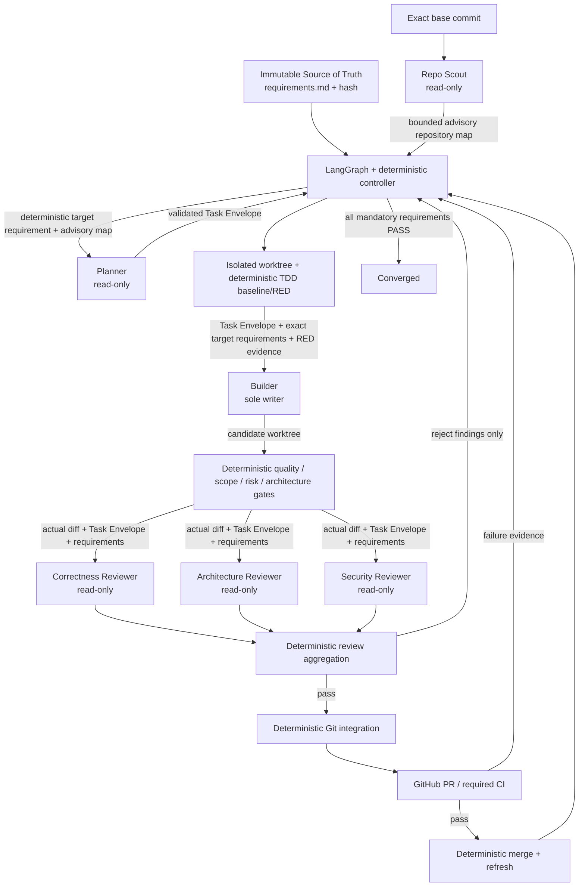

# Role agentów, dobór modeli i przepływ danych

Ten dokument opisuje **kontrakt funkcjonalny**, a nie tylko domyślne nazwy modeli. Model można
wymienić bez zmiany grafu LangGraph, o ile nowy model spełnia wymagania roli. Role, dozwolone dane,
uprawnienia, Skills, MCP i deterministic gates pozostają ważniejsze od konkretnego dostawcy LLM.

Najważniejsza zasada: **modele nie orkiestrują siebie nawzajem**. LangGraph i deterministyczny kod
Converge wybierają następny stan, wymaganie, retry, review, PR, CI i merge. Nie istnieje trwały „czat
między agentami”. Każde wywołanie OpenCode jest świeżą sesją, a jawne artefakty przejściowe są
przenoszone przez stan LangGraph/evidence.

## Profil modelu to nie agent

W `converge.yaml` sekcja `models.profiles` opisuje parametry modeli wielokrotnego użytku. Sekcja
`agents` wiąże profil z konkretną funkcją. Dlatego nazwa profilu `reviewer` nie oznacza jednego
uniwersalnego Reviewera, a profil `planner` może być użyty zarówno przez Plannera, jak i niezależnego
Architecture Reviewera.

Referencyjny routing quality-first wygląda tak:

| Profil | Model referencyjny | Rola runtime |
| --- | --- | --- |
| `scout` | `deepseek-v4-flash:cloud` | Repo Scout |
| `planner` | `deepseek-v4-pro:cloud` | Planner oraz Architecture Reviewer |
| `builder` | `kimi-k2.7-code:cloud` | Builder |
| `reviewer` | `glm-5.3-flash:cloud` | Correctness Reviewer |
| `security` | `gpt-oss:120b` | Security Reviewer |

Nie należy odczytywać tych nazw jako twardej zależności od producenta. Są to przykładowe profile
spełniające różne kompromisy: szybkość, reasoning, coding, szerokość kontekstu i niezależność review.

## Dokładne kontrakty ról

### Repo Scout

**Cel:** szybko zbudować aktualną, evidence-backed mapę dokładnego base commit przed planowaniem.

Scout może czytać repozytorium, strukturę, deklaracje zależności, testy i istotne granice
architektoniczne. Nie wybiera następnego wymagania, nie tworzy Task Envelope i nie proponuje
implementacji. Jego wynik jest **advisory**: Planner ma go zweryfikować względem repozytorium i
niezmiennego Source of Truth.

Typowy handoff: ścieżki istotnych modułów/testów, granice, ryzykowne powierzchnie, jawne
niepewności. Nie przekazujemy pełnej historii sesji ani surowego „rozumowania” modelu.

### Planner

**Cel:** dla requirement ID wybranego przez deterministyczny scheduler zaplanować **jeden najmniejszy
wysokowartościowy krok zbieżności**.

Planner jest read-only. Otrzymuje target requirement, wymagania architektoniczne potrzebne do decyzji,
advisory Repo Scout i jawny stan postępu. Zwraca ustrukturyzowany `TaskEnvelope`: cel, allowed paths,
acceptance criteria, ryzyko, change kind i kontrakt TDD. Nie może zmienić requirement ID na łatwiejszy,
nie pisze kodu i nie steruje GitHubem.

### Builder

**Cel:** zrealizować dokładnie jeden Task Envelope w izolowanym worktree.

Builder jest **jedynym LLM writerem**. Dostaje tylko target requirement statements/source anchors,
Task Envelope i — gdy dotyczy — zweryfikowane evidence fazy TDD RED. Nie potrzebuje pełnej historii
Plannera ani narracji Scouta. Może czytać i edytować bieżący worktree oraz uruchamiać lokalne
narzędzia potrzebne do implementacji/testów. Nie może wykonywać `git push`, `gh`, merge, destructive
reset/clean ani edytować Source of Truth. Integracja Git/GitHub pozostaje deterministycznym kodem
Converge.

### Correctness Reviewer

**Cel:** niezależnie znaleźć błędy funkcjonalne, regresje, edge cases, słabe testy i niejawne zmiany
kompatybilności.

Jest read-only i ocenia **rzeczywisty diff + kod + Task Envelope + wymagania**, a nie opis Buildera.
Powinien należeć do innej rodziny modelowej niż Builder, gdy jest to praktyczne, aby ograniczyć
skorelowany self-review.

### Architecture Reviewer

**Cel:** wykrywać architectural drift, niewłaściwy kierunek zależności, przekroczenie granic, scope
expansion, accidental public API changes i rozwiązania lokalnego zadania przez osłabienie docelowej
architektury.

Jest read-only. Może używać tej samej rodziny modelowej co Planner, ponieważ nie ocenia własnej
implementacji i działa w świeżej sesji, ale musi być niezależny od Buildera.

### Security Reviewer

**Cel:** niezależnie ocenić security-sensitive część zmiany: authn/authz, secrets, injection,
command/path handling, insecure defaults, dependency regressions i trust boundaries.

Jest read-only. Preferowany jest model niezależny od Buildera i pozostałych reviewerów. Brak odpowiedzi,
awaria procesu albo malformed review nie oznacza „braku problemów” — failure-to-review blokuje
integrację.

## Deterministyczny Orchestrator nie jest kolejnym agentem LLM

Nie dodajemy osobnego modelu „manager/orchestrator”. Taki model zwiększałby ryzyko dryftu celu i
ukrytych decyzji. Funkcję koordynacji pełni LangGraph + deterministic Python controller. To on:

- wybiera target requirement według jawnej polityki;
- uruchamia Scout/Planner/Builder/Reviewers;
- pilnuje limitów retry/replan i context budgets;
- wykonuje deterministic quality/risk/architecture gates;
- kontroluje worktree, commit/push, PR, CI i opcjonalny merge;
- odtwarza workflow po crashu;
- eskaluje HITL dopiero w zdefiniowanych wyjątkach.

## Model przepływu pracy



Strzałki oznaczają **jawne artefakty danych**, nie bezpośrednie rozmowy agent-agent. Reviewer nie
otrzymuje ukrytej sesji Buildera. Builder nie dostaje surowego transcriptu Plannera. Repair loop
otrzymuje znormalizowane findings i deterministic gate evidence.

## Dozwolone handoffy danych

| Z | Do | Dozwolony artefakt | Dlaczego |
| --- | --- | --- | --- |
| Source of Truth | wszystkie potrzebujące role | requirement IDs, statements, source anchors | autorytatywny cel |
| Scout | Planner | bounded advisory repo map | szybka orientacja, bez trwałej narracji |
| Planner | Builder | validated Task Envelope | dokładny zakres pracy |
| TDD controller | Builder | zweryfikowane RED evidence | RED -> GREEN bez osłabiania testu |
| Builder/worktree | Reviewers | actual diff + niezbędny surrounding code | niezależne evidence |
| quality/risk gates | controller/repair | structured results | deterministyczna decyzja |
| Reviewers | Builder repair | zagregowane, lane-attributed findings | naprawa bez transferu sesji reviewera |
| LangGraph | kolejna iteracja | bounded working-memory fields | kontrolowana ciągłość |

Nie są dozwolone jako domyślny handoff: ukryta historia czatu, `--continue`/shared model session,
provider credentials, pełny katalog state/evidence, surowy output innego agenta bez potrzeby,
Builder narrative jako dowód dla Reviewera ani credentials MCP przypisane innej roli.

## MCP: least privilege per role

Serwery MCP są zdefiniowane centralnie pod `opencode.mcp.servers`, ale **nie powinny być automatycznie
aktywne dla wszystkich agentów**. Converge traktuje wpis `tool_permissions: <server>_*` jako jawne
przypisanie MCP do konkretnej roli. W runtime znane serwery nieprzypisane do aktywnej roli są
`enabled: false`, a ich `{env:SECRET}` nie jest przekazywany do procesu agenta.

Przykład:

```yaml
opencode:
  mcp:
    servers:
      docs:
        type: remote
        url: https://mcp.example.com/mcp
        headers:
          X-API-Key: "{env:DOCS_MCP_API_KEY}"

agents:
  scout:
    agent: converge-scout
    model_profile: scout
    tool_permissions:
      docs_*: allow

  builder:
    agent: converge-builder
    model_profile: builder
    tool_permissions: {}
```

Tutaj tylko Scout może użyć `docs_*` i tylko jego proces dostaje `DOCS_MCP_API_KEY`. Builder nie
uruchamia tego serwera i nie otrzymuje jego sekretu.

Zalecany zakres MCP:

| Rola | Dobre MCP | Nie dawać agentowi |
| --- | --- | --- |
| Scout | read-only code search, dokumentacja, schema/catalog | write/deploy/GitHub mutation |
| Planner | read-only docs, issue metadata, architecture catalog | write DB, merge, deploy |
| Builder | project-specific build/test helpers, read-only docs | GitHub push/merge, deployment, secrets admin |
| Correctness Reviewer | read-only repo/docs/test metadata | write tools |
| Architecture Reviewer | read-only dependency/docs/catalog | write tools |
| Security Reviewer | read-only security/dependency metadata | credential mutation, deploy/write |

Krytyczne operacje Git/GitHub/test policy pozostają deterministic host code, a nie agentowym MCP.
Dzięki temu niedeterministyczny model nie może sam „przegłosować” gate lub wykonać merge.

## Skills: role-specific, managed i ukryte dla innych ról

Converge materializuje własne, zaufane Skills poza target repo do
`<state_dir>/opencode-runtime/skills/` i wskazuje ten katalog przez `OPENCODE_CONFIG_DIR`. Permission
`skill` jest allowlistą per rola; wildcard `*` jest `deny`, więc przypadkowe global/project Skills nie
stają się instrukcjami wszystkich agentów.

| Rola | Managed Skills |
| --- | --- |
| Scout | `repo-scout`, `requirements-compliance` |
| Planner | `bounded-planning`, `requirements-compliance` |
| Builder | `test-driven-change`, `requirements-compliance` |
| Correctness Reviewer | `correctness-review`, `requirements-compliance` |
| Architecture Reviewer | `architecture-review`, `requirements-compliance` |
| Security Reviewer | `security-review`, `requirements-compliance` |

`task` pozostaje denied, dlatego agent nie może uruchamiać ukrytych subagentów i tworzyć drugiego,
niekontrolowanego kanału pamięci/delegacji.

## Jak świadomie zastąpić model

Najpierw zachowaj **rolę**, potem wymieniaj profil modelu. Użytkownik powinien ocenić model na zadaniach
zbliżonych do swojego repo, a nie tylko po liczbie parametrów lub marketingowej długości context window.

| Rola | Cechy krytyczne | Cechy pożądane | Odrzuć model, gdy... |
| --- | --- | --- | --- |
| Scout | stabilne read/tool calling, dobre code/repo summarization, instruction following | niski latency/koszt, długi kontekst | myli obserwacje z planem, łamie read-only, tool calls są niestabilne |
| Planner | silny reasoning, ścisłe JSON/schema following, rozumienie architektury, minimal scope | szeroki kontekst, dobre TDD reasoning | często zmienia target, proponuje broad rewrite, nie potrafi zwrócić Task Envelope |
| Builder | coding accuracy, wieloetapowy tool loop, test literacy, patch discipline | dobre debugging/refactoring, 128k–256k+ użytecznego kontekstu | gubi stan tool loop, psuje testy/API, generuje duże przypadkowe diffy |
| Correctness Reviewer | code reasoning, adversarial bug finding, edge cases/test/backcompat | inna rodzina niż Builder, długi kontekst | rubber-stamps diff, powtarza narrację Buildera, słabo wykrywa regresje |
| Architecture Reviewer | dependency/boundary reasoning, requirement adherence, scope discipline | duży kontekst repo/architektury | optymalizuje lokalny kod kosztem Source of Truth albo nie rozpoznaje driftu |
| Security Reviewer | secure-code reasoning, trust boundaries, auth/injection/path/secret analysis | niezależna rodzina, local/private option | ma wysoki false-negative na security albo ujawnia dane w output/tool calls |

Minimalny praktyczny filtr dla **każdej** roli:

1. model musi stabilnie wykonywać instrukcje i format wymagany przez rolę;
2. jeśli rola używa narzędzi, tool calling musi być powtarzalny;
3. zadeklarowany `context_tokens` musi mieścić authoritative core + output reserve; Converge nie ucina
   core po cichu;
4. model musi przejść mały benchmark na rzeczywistym repo: poprawność struktury output, liczba
   niepotrzebnych tool calls, latency, koszt i częstość retry;
5. dla review preferuj co najmniej jedną rodzinę niezależną od Buildera;
6. nie wybieraj modelu wyłącznie dlatego, że ma największy context window.

### Wagi przy doborze modelu

Orientacyjne priorytety (5 = krytyczne):

| Cecha | Scout | Planner | Builder | Correctness | Architecture | Security |
| --- | ---: | ---: | ---: | ---: | ---: | ---: |
| Reasoning | 3 | 5 | 4 | 5 | 5 | 5 |
| Coding/tool-loop | 2 | 3 | 5 | 4 | 3 | 4 |
| Structured output | 4 | 5 | 3 | 5 | 5 | 5 |
| Długi kontekst | 4 | 5 | 4 | 4 | 5 | 3 |
| Szybkość/koszt | 5 | 2 | 3 | 3 | 2 | 2 |
| Niezależność od Buildera | 1 | 2 | — | 5 | 4 | 5 |
| Security reasoning | 1 | 2 | 3 | 3 | 3 | 5 |

Wagi są kryterium wyszukiwania/benchmarku, nie automatycznym rankingiem dostawców.

## Audyt izolacji danych

Podczas przeglądu runtime zidentyfikowano dwa konkretne kanały nadmiernej ekspozycji i zostały one
zamknięte w kodzie:

1. **host mode dziedziczył całe `os.environ`** — proces agenta mógł widzieć sekrety niezwiązane ze
   swoją rolą. Agent scope używa teraz minimalnego środowiska OS + jawnego `sandbox.pass_env` +
   credentialu gateway + credentials tylko role-assigned MCP + runtime config vars;
2. **container agent miał read-only mount całego `state_dir`** — był tam m.in. context ledger,
   provider health i evidence innych faz. OpenCode nie dostaje już pełnego state mount; montowane są
   tylko generated runtime config i managed Skills potrzebne do wykonania roli.

Dodatkowo każde wywołanie pozostaje fresh session, Skills są allowlistowane per role, a skonfigurowane
MCP są w runtime wyłączane dla ról bez jawnego `<server>_*` permission.

### Pozostałe świadome ograniczenie

`host` sandbox jest trybem zgodności, a nie silną granicą bezpieczeństwa OS. Builder ma lokalny shell i
na hoście może technicznie czytać pliki dostępne dla konta systemowego. Filtrowanie env usuwa
najprostszy przeciek sekretów, lecz pełna izolacja poufnych danych wymaga `sandbox.mode: container`,
minimalnych mountów, wewnętrznej sieci agentów i wąsko scoped credentials. Target/global OpenCode
config może również definiować własne pluginy/MCP; inline permissions blokują ich narzędzia, ale dla
untrusted repository hardened container pozostaje obowiązkowym profilem deploymentowym.
